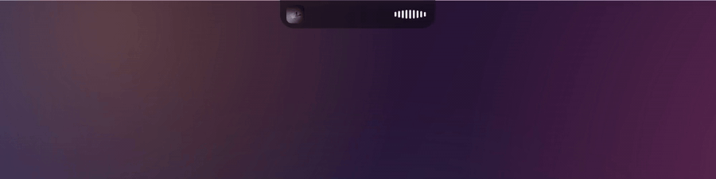
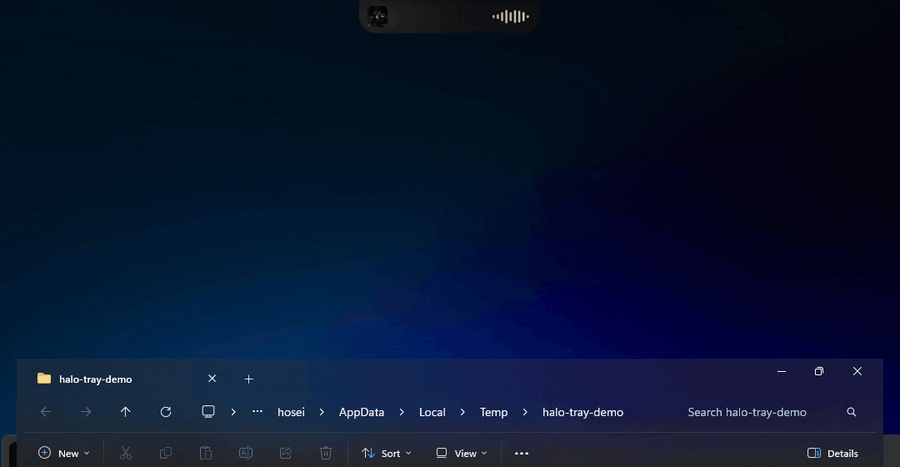
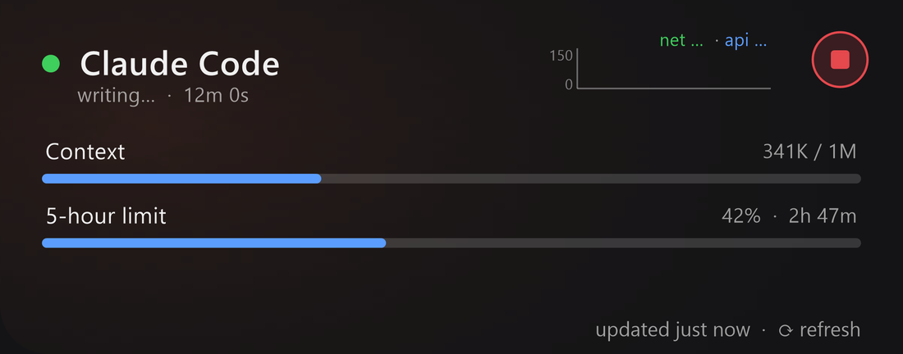

**A glass notch for Windows — the Dynamic Island your desktop never got.**

 

 

**English** · [فارسی](README.fa.md)

[⬇️ Download](https://github.com/phoseinq/DynamicWin/releases/latest) · [Report a bug](https://github.com/phoseinq/DynamicWin/issues) · [Request a feature](https://github.com/phoseinq/DynamicWin/issues)

 

  

### 👉 [Try the pill in your browser](https://pvboy.dev/assets/blog/halo-live.html)

No install. Hover it, open the panel, drag the seek bar, tap the circle to swap app.

 

A single pill of glass sits at the top of your screen. It comes forward when something is worth
saying and folds away when nothing is — what's playing, the notification that just arrived, a file
you want to carry from one window to another. No app to open, nothing covering your work.

 

<h2 align="center">⬇️ Install</h2>

| Download | What it is |
| :-- | :-- |
| **[DynamicWinSetup.exe](https://github.com/phoseinq/DynamicWin/releases/latest/download/DynamicWinSetup.exe)** | Installer. Per-user, no admin prompt. Offers to start with Windows and to hook into Codex. |
| **[DynamicWinPortable.zip](https://github.com/phoseinq/DynamicWin/releases/latest/download/DynamicWinPortable.zip)** | No install — unzip and run `Halo\Halo.App.exe`. |

**Windows 11 · x64.** It opens at the top-centre of your main monitor. Press and hold to drag it
anywhere; it stays where you put it. Once installed it updates itself quietly in the background.

 

<h2 align="center">🎵 Media</h2>

Collapsed, it is a waveform driven by the actual system output. Open, it is the whole player: album
art, the track, a seek bar that thickens under your cursor and follows your hand instead of waiting
on the player to answer, volume, and transport. Video also gets ±10s, playback speed and subtitles.

It reads Windows' own media session, so it works with whatever you already have open.

 

<h2 align="center">🔔 Notifications</h2>

Every toast lands in the pill with the *real* app icon, and the native Windows banner goes quiet so
you are not told the same thing twice.

The clip is the part I use most: the notification carries a **verification code**, so the pill lifts
it out and puts it on a button. One click and it says *Copied* — no opening the app, no dragging a
cursor across six digits.

 

<h2 align="center">📁 File tray</h2>

Drag a file out of a folder and onto the pill: it opens, counts what it is holding, and keeps it.
Drag it back out into any window later — a different app, a different desktop, twenty minutes on.
It is the "hold this for a second" move Windows never had.

 

<h2 align="center">🤖 Coding sessions</h2>

A live panel per **Claude Code** and **Codex** session: what it is doing right now, context left,
your 5-hour and weekly limits as a ring, and a Cancel that stops the running prompt. Any other tool
can join by writing a small JSON file.

 

<h2 align="center">…and the quiet ones</h2>

- ⬇️ **Downloads** — real progress in Chrome and Edge, and a Cancel that actually cancels.
- 🔋 **Bluetooth battery** — connect headphones, a controller or your phone and the pill shows the level.
- ⚠️ **Alerts** — battery, CPU, RAM and internet, each fired once when it happens rather than nagged.
- 📌 **Pin** — keep it above fullscreen apps. Hold the pushpin to make it visible in screen recordings too.
- 🔄 **Silent updates** — no prompt, no window.

 

<h2 align="center">🔒 Privacy</h2>

No account, no server, no telemetry. Everything the pill shows you stays on your machine.
[**PRIVACY.md**](PRIVACY.md) lists every file Halo writes and every network request it can make —
there are nine, and each one says what it discloses.

 

> [!NOTE]
> Halo is a from-scratch rewrite of [DynamicWin](https://github.com/FlorianButz/DynamicWin) by Florian Butz — no upstream code. Built with .NET 9.

 

---

⭐ **If you install it and end up liking the little assistant, support the project with a star.**

MIT License · made by <a href="https://github.com/phoseinq">phoseinq</a> · <a href="https://pvboy.dev">pvboy.dev</a>

